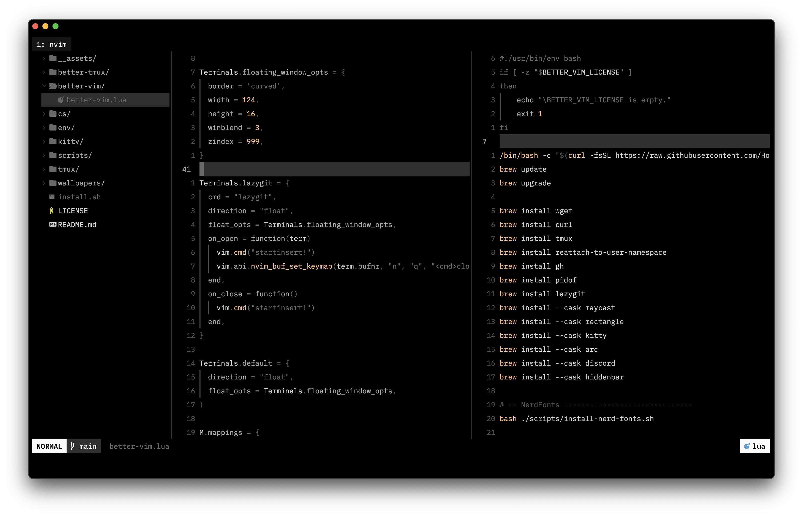
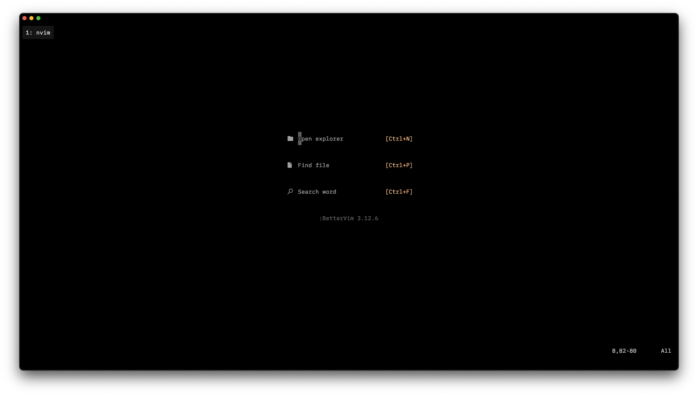
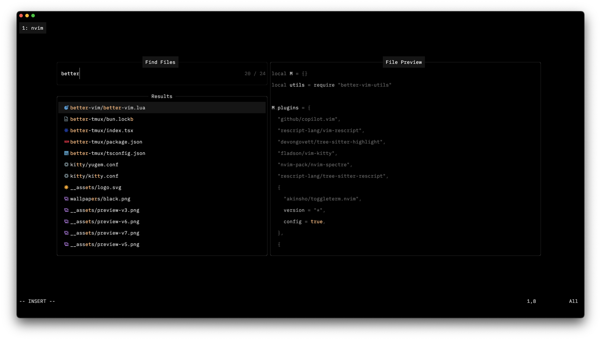
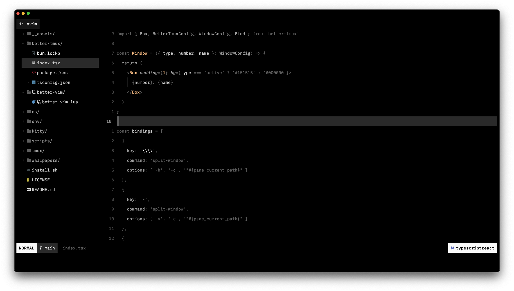

# yugen 🌌

**yugen** is a Neovim theme inspired by the profound beauty and depth of the concept of "yūgen." It provides a minimalist and aesthetically pleasing color scheme for coding, highlighting both subtle and profound elements in your workspace.

<p align="center">
  
</p>

<details>
<summary>More screenshots 🖼️ </summary>
  




</details>

## Installation 📦

To use **yugen** in Neovim, follow the installation instructions below based on your preferred plugin manager.


### Using [lazy.nvim](https://github.com/folke/lazy.nvim)

Add the following line to your lazy configuration:

```lua
{
    'bettervim/yugen.nvim',
    config = function()
        vim.cmd.colorscheme('yugen')
    end,
}
```

Then, run the following in Neovim:

```vim
:Lazy sync
```

Add the line to your `init.vim` or `init.lua` to make it your default theme.

## Credits 👤

This theme started as a fork of [poimandres.nvim](https://github.com/olivercederborg/poimandres.nvim), and its foundation is still used by the theme. A big thanks to the original creators for their amazing work and inspiration.


## License ⚖️

yugen is licensed under the MIT License. See the [LICENSE](https://github.com/bettervim/yugen).
